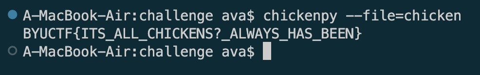

# Chicken Again
Level - Medium

Description:
```markdown
We heard you guys loved `chicken` so much last year, we decided to give you another one!

[chicken]
```

## Writeup
It's a program written in an esoteric programming language called [chicken](https://esolangs.org/wiki/Chicken). If you run it through some interpreter like [chickenpy](https://github.com/kosayoda/chickenpy) the output is the flag:



**Flag** - `BYUCTF{ITS_ALL_CHICKENS?_ALWAYS_HAS_BEEN}`

## Hosting
See `dev files` folder for info on how it was compiled (made with help from [this](https://github.com/powder96/ChickenASM-PHP) translation tool).