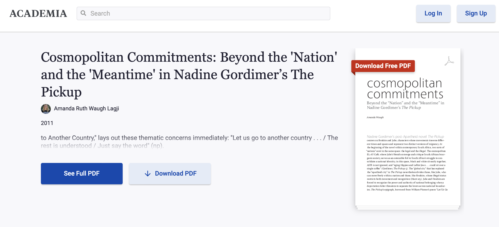

# Criterion
Level - Hard

Description:
```markdown
I was reading up on literary criticism recently, and I noticed that my favorite BYU journal, Criterion, was missing a few issues from their database. Could you please find the old issues for me? Once you find them, please let me know what movie was referenced on the cover of their fourth issue.

Flag format - `byuctf{TitleOfTheMovie}`
```

## Writeup
This past semester, I reached a crossroads between two of my collegiate pursuits, competing in CTFs with BYU Cybersecurity students and editing for *Criterion: A Journal of Literary Criticism*.  During my tenure as Editor-in-Chief of *Criterion*, a new English class was created in order to give students an opportunity to gain credit for their participation in *Criterion* and assist them in their professional development along the way.  With the creation of this new class, we had the additional resources to take on some long-needed projects, such as the creation of [our new website](https://criterion.byu.edu).  One of the projects that I undertook was to retroactively publish five issues of *Criterion* that were missing from our [ScholarsArchive](https://scholarsarchive.byu.edu/criterion) database.  Completing this task turned out to be quite the endeavor, and required me to draw upon the open-source intelligence (OSINT) gathering skills that I had developed through participation in CTFs (as well as many years of experience in Googling).

I began by digging through old emails (okay, that part wouldn't be considered OSINT) and running a ton of searches on Google and Google Scholar.  These searches involved trying to limit results to BYU's *Criterion* (i.e., excluding all the other journals with "Criterion" in their name), specifying date ranges, and limiting searches to specific websites.  One of my best discoveries through this method was a full PDF of our fifth issue, published in 2012, that had been [uploaded to academia.edu](https://www.academia.edu/13114628/_Border_Women_Reclaiming_a_Feminine_Narrative_within_the_Nation_State_) by one of our past authors.


With some further searching, I was able to find two additional authors who had published their essays to Academia as well.  One of the articles, ["Speaking Through Death in Toni Morrison's Beloved and Jean Rhys's Wide Sargasso Sea"](https://www.academia.edu/82262792/Speaking_Through_Death_in_Toni_Morrisons_Beloved_and_Jean_Rhyss_Wide_Sargasso_Sea) was from our 2013 issue, which was already available through our ScholarsArchive page.


The other, ["Cosmopolitan Commitments: Beyond the 'Nation' and the 'Meantime' in Nadine Gordimer’s The Pickup"](https://www.academia.edu/6786292/Cosmopolitan_Commitments_Beyond_the_Nation_and_the_Meantime_in_Nadine_Gordimer_s_The_Pickup) was from our missing 2011 issue, but unfortunately for me, the author had only uploaded her essay, and not the entire issue.



With some more searching, I found another lead—[an Amazon listing](https://www.amazon.com/Criterion-Journal-Literary-Criticism-Spring/dp/B06XD9X2PK) for our third issue, which was published back in 2010.  At the time, it was listed for sale by a used book shop in Las Vegas.  Amazon says that it is no longer available, so perhaps it was sold or simply delisted.


The listing gave me a good idea of what the issue's cover looked like (as part of my project to complete our database, I was additionally seeking out the cover art of past issues), but more importantly it listed the titles of each article contained in the issue.  Using this contents information, I had a whole ton of additional material to go searching for.

Using the newly discovered titles, I was able to locate a number of authors who had listed their articles in the Publications section of their LinkedIn profiles.


Only one of these articles actually had a link associated with it, http://english.byu.edu/criterion/links/interior3.pdf, which leads to a dead page.


Fortunately, this dead link was *not* a dead end.  Using the Internet Archive's [Wayback Machine](https://web.archive.org), I was able to recover the document that had preciously resided at this link—[issue number three](https://web.archive.org/web/20160708192713/http://english.byu.edu/criterion/links/interior3.pdf)!


Moving up to the directory level, I was able to locate a number of files that previously existed under http://english.byu.edu/criterion/links/


Here I found all of the missing issues, their original cover art (albeit at a very low resolution of 300 × 450 pixels), and what appears to have been the original *Criterion* website!


On our [new website](./img/new_website.png), we now have links to all of *Criterion*'s past issues, complete with (almost) all of the cover art:


**Flag** - `byuctf{BackToTheFuture}`