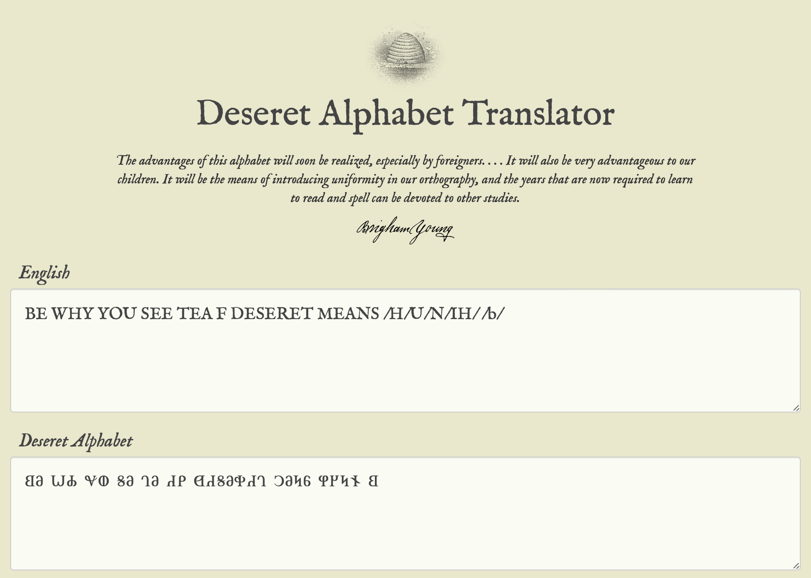
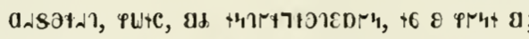

# 𐐗𐐡𐐆𐐑𐐓𐐄?
Level - Medium

Description:
```markdown
Flag format: `byuctf{WORD_OR_PHRASE}`

[chall.png]
```

## Writeup
The first step in solving this challenge is to determine what alphabet is being used.  This can be done in one of two ways.  The easier way is to copy and paste the characters from the challenge title into a search engine.  You likely won't get any results searching for the whole title, but if you search for individual characters or add spaces to the title, you will discover that the characters come from the [Deseret Alphabet](https://en.wikipedia.org/wiki/Deseret_alphabet).


Alternatively, you can do a reverse image search.  Again, you won't get any useful results if you search for the whole thing, but if you crop the search down to just one character (I had the most luck with the `𐐏` character), there's a chance that you'll find a match that is useful enough to inform you where the character comes from.

With some research, you'll find that the Deseret Alphabet is a phoenetic alphabet, meaning that each letter represents a different sound, without any of the [English nonsense](https://www.reddit.com/r/dataisbeautiful/comments/gzu9d5/updated_different_ways_to_pronounce_each_letter_oc/) of letters that can be pronounced in multiple ways.  It was originally developed by early members of the Church of Jesus Christ of Latter-day Saints, with the hope that it could be used to represent words across multiple languages and to assist immigrants in their efforts to learn English.

With that in mind, there are a couple of ways to translate the text from the challenge.  The more tedious way is to go through the phoenetic pronunciation of each letter one by one.  An easier method is to use an [online Deseret Alphabet translator](https://www.2deseret.com).

The translator offers an on-screen keyboard for typing in the alphabet, which once translated, becomes:

```
BE WHY YOU SEE TEA F DESERET MEANS /H/U/N/IH/ /b/
```

The original characters are found below:

```
𐐒𐐀 𐐎𐐌 𐐏𐐅 𐐝𐐀 𐐓𐐀 𐐇𐐙 𐐔𐐇𐐝𐐀𐐡𐐇𐐓 𐐣𐐀𐐤𐐞 𐐐𐐊𐐤𐐆 𐐒
```



This might not make a lot of sense on the screen, but if you say it aloud, it becomes `B Y U C T F Deseret means honey bee`.

Getting the last word, "honey bee," may be a bit tricky.  If you can't figure it out based off of the phoenetics, there is another way—just try Googling "what does deseret mean," and you'll find your answer!

The flag is thus `byuctf{DESERET_MEANS_HONEY_BEE}`.

Also acceptable during the CTF were `byuctf{DESERET_MEANS_HONEYBEE}` and `byuctf{DESERET_MEANS_HONEY_B}`. (I was being generous with that last one.)

## Challenge Author's Note

You may be wondering why "honey bee" is rendered as `𐐐𐐊𐐤𐐆 𐐒` and not `𐐐𐐊𐐤𐐀 𐐒𐐀` as the translator site would suggest. The word "deseret" comes from [Ether 2:3](https://www.churchofjesuschrist.org/study/scriptures/bofm/ether/2.3?lang=eng&clang=eng#p3) in the Book of Mormon:

```
And they did also carry with them deseret, which, by interpretation, is a honey bee; and thus they did carry with them swarms of bees, and all manner of that which was upon the face of the land, seeds of every kind.
```

The Book of Mormon was published in the Deseret Alphabet in 1869.  While I don't have a copy of my own, one can be found [on the Internet Archive](https://archive.org/embed/bookofmormdeseretalpha00).  The phrase from above, "deseret, which, by interpretation, is a honey bee," can be found (with some difficulty, as the verses aren't enumerated in early copies of the Book of Mormon as they are today) written as shown below:



"Honey bee" is thus rendered as `𐐐𐐊𐐤𐐆 𐐒` in the challenge in order to stay true to the original text it was taken from.  (And to make the challenge just a little bit more difficult.)


**Flag** - `byuctf{DESERET_MEANS_HONEY_BEE}`