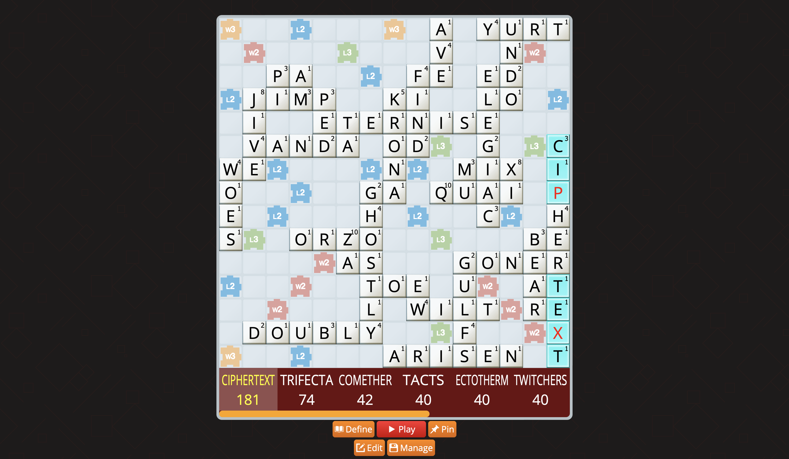

# Q10
Level - Hard

Description:
```
Wrap the flag in `byuctf{}`. The flag is case insensitive.

[file.png]
```

## Writeup
The attached file appears as follows:


You may recognize the layout of these words to be similar to that of a Scrabble board.  The standard English Edition of Scrabble has 100 tiles. On each tile is a letter, with the exception of two blank tiles that act as wildcards.  Each letter occurs a set number of times, although they are not all the same.  For example, there are 9 A tiles, but only 1 Q tile.  Each tile has an associated point value as well.  Since A is fairly common, it is only worth 1 point.  Since Q is rare (both in tile distribution as well as frequency of use in the english language), Q is worth 10 points, hence the name of this challenge, Q10.  Comparing the distribution of letters in the image with the standard tile distribution of Scrabble will confirm that this is indeed a Scrabble board, but that there are 7 tiles missing—one C, one E, one I, two T's, and two blanks.  Significantly, the maximum number of tiles a player may have on their tile rack at a time is also 7.

Below is an image of what this layout would look like on a real Scrabble board, along with the missing letters on the tile rack.


The tiles on the rack don't seem to form a word by themselves, or at least not an obvious one, but that is not how Scrabble is played.  Rather, in a game of Scrabble, one must use their tiles to build a word off of the existing tiles on the board, with the goal of earning the most points possible based on what word is formed.  With this in mind, the goal here is likewise to find the word that will score the most points based on which tiles are available.

You might be able to figure out the best word if you're a Scrabble master, but for the rest of us, we'll have to cheat.  There are a number of websites that allow you to enter the layout of a Scrabble board to see what the best moves are.  I'm sure there are more, but I found 4 different sites that claimed to be able to perform this task.  Two of them worked, as shown below.

Scrabulizer (https://www.scrabulizer.com):


Scrabble Go Cheat (https://www.scrabblegocheat.com/board-editor):



The two other sites that I tried had issues.  One of them, [anagrammer.com](https://www.anagrammer.com/scrabble-board-solver/), did provide possible moves, but they were not optimal.  Another, [thewordfinder.com](https://www.thewordfinder.com/board-solver/scrabble/) seemed to get stuck at solve time, which was frustrating after having taken the time to type in all of the letters one by one.

With a properly working site, you will find that the optimal solution, worth 181 points (that is a TON of points, by the way) is `CIPHERTEXT`.  This is obviously a very CTF-oriented word, and thus a good candidate for the flag.  Wrapping it in `byuctf{}` it becomes `byuctf{CIPHERTEXT}` and is indeed the flag.

**Flag** - `byuctf{CIPHERTEXT}`