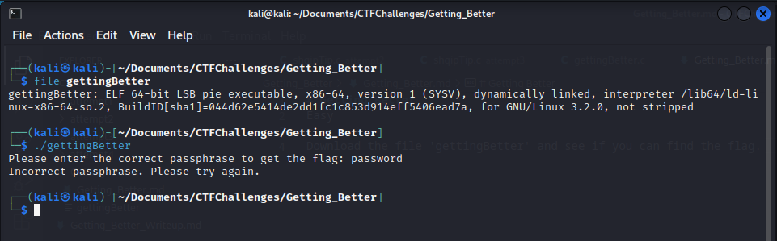
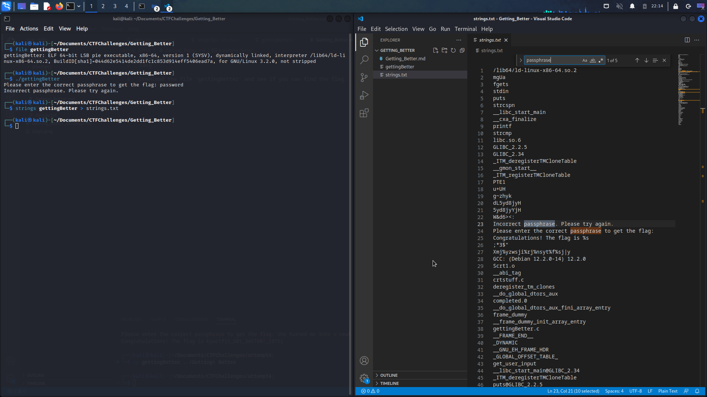
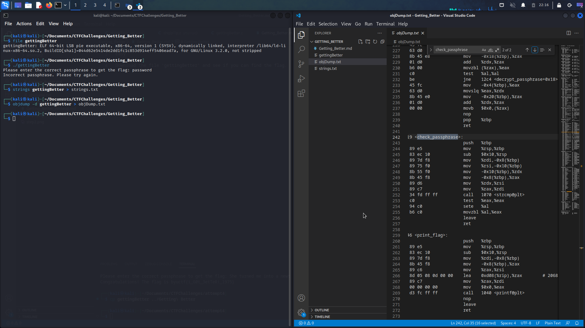
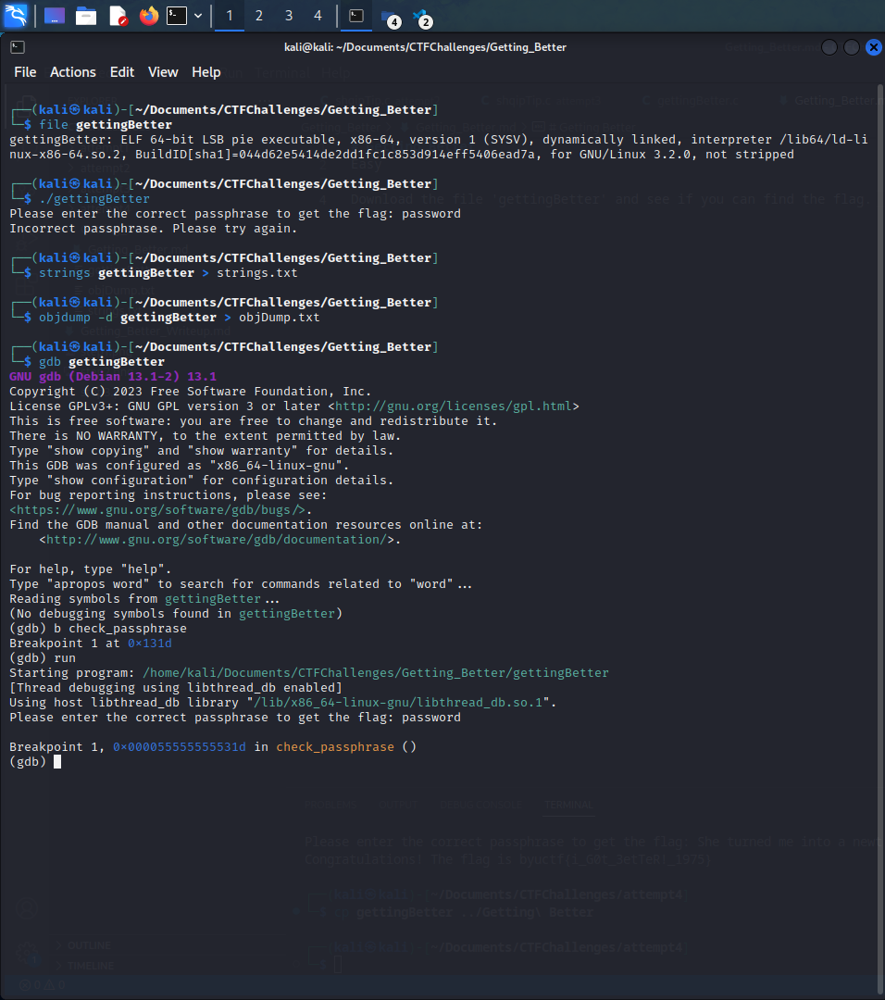
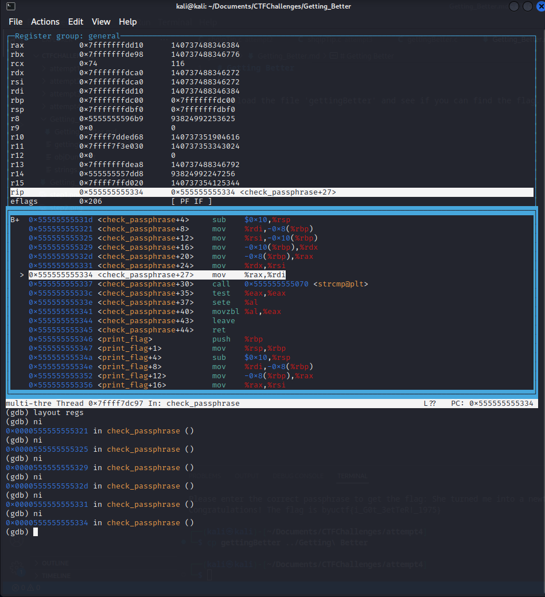
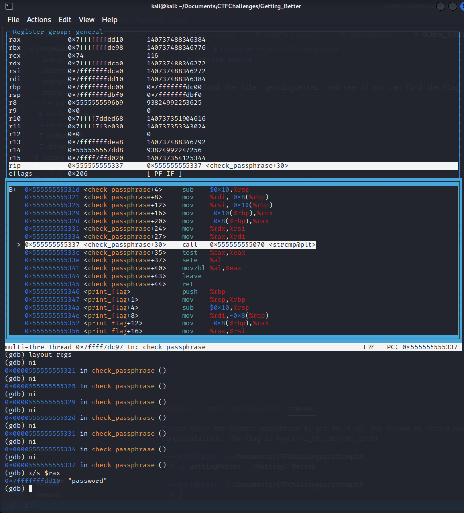
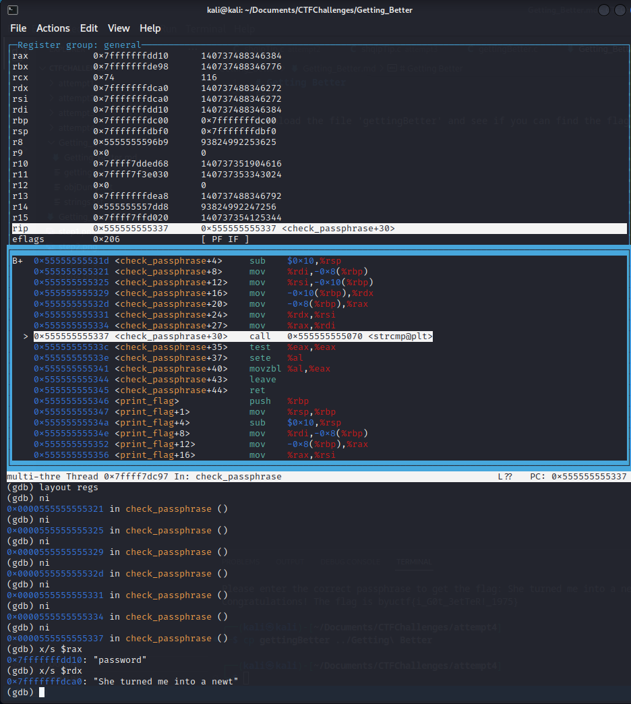
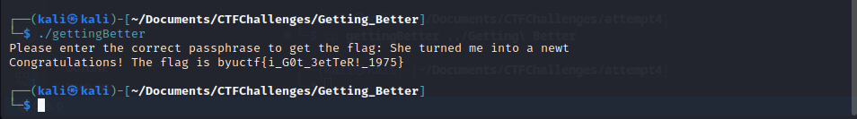

# RevEng
Level - Easy

Description:
```
See if you can find the flag!

[gettingBetter]
```

## Writeup 
Made by Garrett Tautkus, BYU Cyberia

Getting Better is a reverse engineering CTF challenge. It is a simple challenge that involves a single executable. That executable asks for a passphrase in exhange for the flag. The challenge is to retrieve the flag even though you are not given the passphrase.

### Helpful Resources
- Linux enviornment  
- binutils strings  
- objDump  
- gdb debugger  
- VS Code  

### Step 1  
Once the `gettingBetter` file was downloaded I ran the `file` command on it to find out what type of file it is. This query shows us that the file is an executable.

Knowing that, I ran the executable and it asked me for the "correct passphrase". I put in "password" as a placeholder and the program told me that was incorrect and that I should try again.

  

### Step 2
The very next thing that I tried was running `strings` on the executable. This returns a list of all the human readable text that can be found in the executable. I like to direct that output to a text file so I can inspect it a bit easier. Once I have that file open I start searching for relevant words. Things like: "flag", "byuctf", and "passphrase".

As you can see I got a hit on passphrase. I saw multiple instances of it. Some were just in the text that is printed for the user but one instance was the string `check_passphrase`. It was right next to the string `main`. So I had reason to believe this could be a function name. And a function named `check_passphrase` seemed very prominsing. 



### Step 3
In order to proove that `check_passphrase` was a function I did a disasembly `objDump` of the executable. This confirmed that `check_passphrase` was in fact a function.  

It also shed some light on that function. As you can see there is an interesting function call to `strcmp@plt`. The first part of that call, `strcmp`, seems like a refrence to string compare. Whenever I find comparisons in assembly I look into them.  
There are two super important registers right before that call, those are `$rdx` and `$rax`. These are important because right before that string comparison those registers are loaded with the content of some location in memory via `mov` instructions.  
Now we have a function and specific registers to look into.



### Step 4
One easy was we can look into that is by using the gdb debugger. Below you can see I open the executable with the gdb debugger and set a breakpoint for the `check_passphrase` function.




### Step 5
Next in gdb I run the following commands:  
```
run
layout asm
layout regs
```
Then I step forward in the assembly using the `ni` command until I'm past the two `mov` instructions that are bringing data from memory into the `$rax` and `$rdx` registers.




### Step 6
Next I run the `x/s $rax` command to see what the contents of the memory location stored in the `$rax` register are in string form. I can see that is where its storing my own input as it returns "password".



### Step 7
I do the same for the `$rdx` register, `x/s $rdx`. This returns something interesting! The contents of the memory location stored in that register are "She turned me into a newt". That is a phrase, lets try it as our passphrase.




### Step 8
Finally I exit gdb and run the executable again. I enter "She turned me into a newt" and the executable returns the flag!



### Sources
- [PicoCTF (Ideas for RevEng CTF Formats)](https://picoctf.org/)
- [W3 Schools (C Syntax)](https://www.w3schools.com/c/c_arrays.php)  
- [GDB Documentation](https://sourceware.org/gdb/current/onlinedocs/gdb)  
- [Chat GPT (Obfuscation Help)](https://chat.openai.com/)  